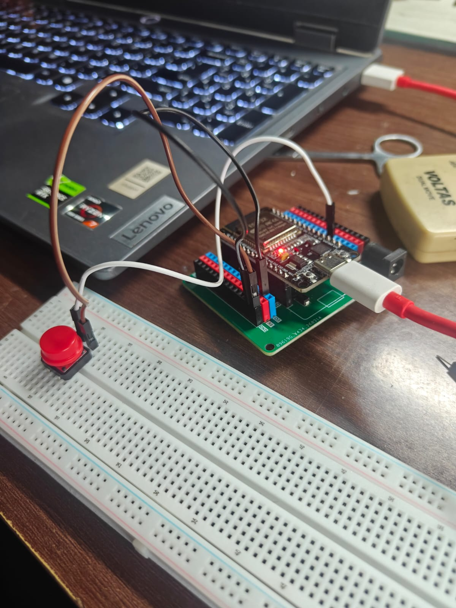

# ESP32 Digital Counter - Version 1

A simple digital counter built using an ESP32 and a push button. Every button press increments the counter by **1**, with the updated value displayed on the Arduino IDE Serial Monitor.

This project introduces reading digital inputs using the ESP32's built-in pull-up resistor and serves as the foundation for more advanced button-based projects.

---

## Features

- Increment counter using a push button
- Display counter value on the Serial Monitor
- Uses ESP32's internal pull-up resistor (`INPUT_PULLUP`)
- Simple and beginner-friendly implementation

---

## Components Required

- ESP32 Development Board
- Push Button (4-pin tactile switch)
- Breadboard
- Jumper Wires

---

## Circuit Connections

| Component | ESP32 Pin |
|----------|-----------|
| Push Button | GPIO 4 |
| Push Button | GND |

> **Note:** The button is configured using the ESP32's internal pull-up resistor, so no external resistor is required.

---

## Working Principle

- The push button is connected between **GPIO 4** and **GND**.
- The GPIO pin is configured as `INPUT_PULLUP`, meaning it normally reads **HIGH**.
- When the button is pressed, the pin is connected to **GND**, causing it to read **LOW**.
- Each detected press increments the counter by one.
- The updated counter value is printed to the Serial Monitor.

---

## Example Output

```
Counter = 1
Counter = 2
Counter = 3
Counter = 4
```

---

## Concepts Learned

- Digital Inputs
- GPIO Configuration
- Internal Pull-Up Resistors
- Reading Push Button States
- Conditional Statements (`if`)
- Variables and Counters
- Serial Communication

---

## Current Limitation

This version uses a simple `delay(200)` after each detected button press. While effective for basic testing, holding the button will continue incrementing the counter, and mechanical switch bounce is not handled.

These limitations will be addressed in **Version 2** with proper software debouncing and edge detection.

---

## Future Improvements

- Software Debouncing
- OLED Display Integration
- Increment, Decrement and Reset Buttons
- Long Press Reset Functionality

---

## Images

### Circuit Diagram



### Demo


## Author

**Danger Volt**

Learning Embedded Systems one project at a time.