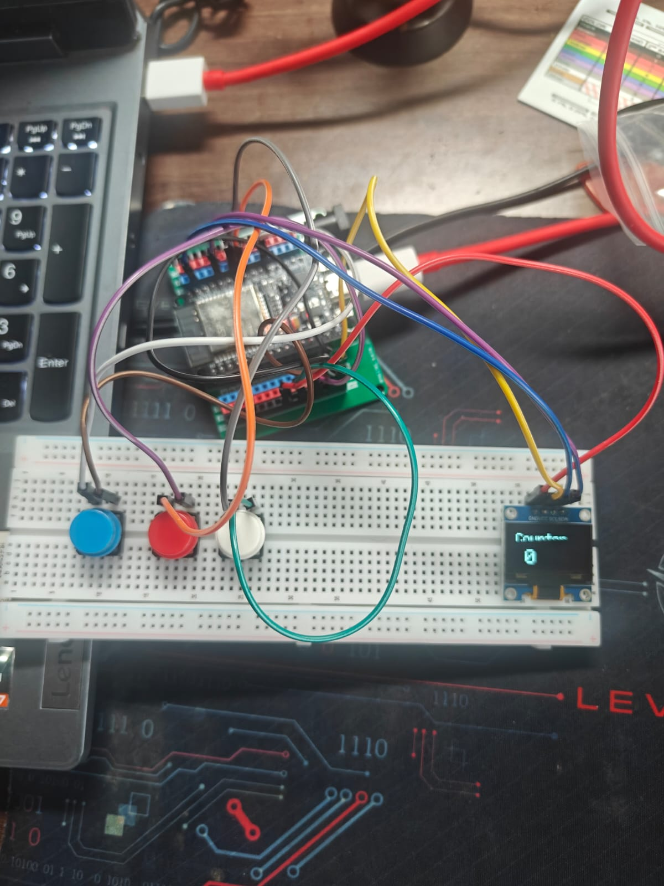

# ESP32 Digital Counter - Version 4

Version 4 transforms the digital counter into a standalone embedded system by integrating a **0.96-inch SSD1306 OLED Display**. Instead of displaying the counter value on the Arduino IDE Serial Monitor, the current count is now shown directly on the OLED screen.

This version combines multiple button inputs with a graphical output device, introducing I²C communication and display programming while retaining the edge detection and software debouncing implemented in previous versions.

---

## Features

- Increment counter using a dedicated push button
- Decrement counter using a dedicated push button
- Reset counter to zero
- One count per button press
- Software edge detection
- Basic software debouncing
- OLED display output
- Prevents the counter from going below zero
- Uses ESP32's internal pull-up resistors (`INPUT_PULLUP`)

---

## Components Required

- ESP32 Development Board
- 0.96" SSD1306 OLED Display (I²C)
- 3 × Push Buttons (4-pin tactile switches)
- Breadboard
- Jumper Wires

---

## Circuit Connections

### Push Buttons

| Component | ESP32 Pin |
|----------|-----------|
| Increment Button | GPIO 4 |
| Decrement Button | GPIO 5 |
| Reset Button | GPIO 18 |
| All Buttons | GND |

### OLED Display

| OLED Pin | ESP32 Pin |
|----------|-----------|
| VCC | 3V3 |
| GND | GND |
| SDA | GPIO 21 |
| SCL | GPIO 22 |

> **Note:** All buttons use the ESP32's internal pull-up resistors, so no external resistors are required.

---

## Required Libraries

Install the following libraries using the Arduino Library Manager:

- Adafruit GFX Library
- Adafruit SSD1306 Library

---

## Working Principle

- Three push buttons control the counter:
  - Increment
  - Decrement
  - Reset
- Each button is configured using `INPUT_PULLUP`.
- Edge detection is used to identify a new button press.
- A short software debounce delay filters out switch bounce.
- Every valid button press updates the counter.
- The OLED display is refreshed immediately to show the latest counter value.

---

## Display Output

```
Counter

0
```

After pressing the increment button:

```
Counter

1
```

---

## Concepts Learned

- Multiple Digital Inputs
- GPIO Configuration
- Internal Pull-Up Resistors
- Edge Detection
- Software Debouncing
- I²C Communication
- OLED Display Programming
- Display Buffer Management
- Function-Based Code Organization

---

## Improvements Over Version 3

- Replaced Serial Monitor output with an OLED display
- Introduced I²C communication
- Added a reusable display update function
- Converted the project into a standalone embedded system without requiring a PC to monitor the counter

---

## Future Improvements

- Long Press Detection
- Non-blocking Debouncing using `millis()`
- Animated OLED Interface
- Startup Splash Screen
- Battery-Powered Standalone Operation

---

## Images

### Circuit Diagram



### Demo


## Author

**Danger Volt**

Learning Embedded Systems one project at a time.