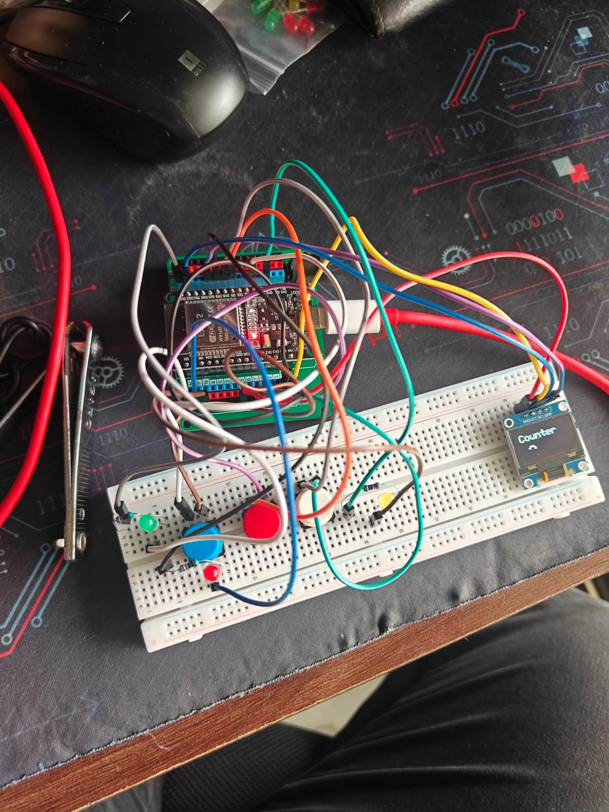

# ESP32 Digital Counter - Version 5 (Final)

Version 5 is the final and most polished version of the ESP32 Digital Counter project. Building upon the previous versions, this iteration introduces a more user-friendly interface by integrating LED status indicators, a startup splash screen, and a dedicated reset screen, making the project feel like a complete standalone embedded system.

The project combines digital inputs, digital outputs, OLED graphics, and structured programming to demonstrate several fundamental concepts in embedded systems.

---

## Features

- Increment counter using a dedicated push button
- Decrement counter using a dedicated push button
- Reset counter to zero
- One count per button press using edge detection
- Software debouncing
- 0.96" SSD1306 OLED display output
- Startup splash screen
- Dedicated reset notification screen
- LED feedback for each button action
- Standalone embedded system with no Serial Monitor required

---

## Components Required

- ESP32 Development Board
- 0.96" SSD1306 OLED Display (I²C)
- 3 × Push Buttons (4-pin tactile switches)
- 3 × LEDs
  - Green LED
  - Red LED
  - Yellow LED
- 3 × 220Ω Resistors
- Breadboard
- Jumper Wires

---

## Circuit Connections

### Push Buttons

| Component | ESP32 Pin |
|----------|-----------|
| Increment Button | GPIO 4 |
| Decrement Button | GPIO 5 |
| Reset Button | GPIO 18 |
| All Buttons | GND |

### OLED Display

| OLED Pin | ESP32 Pin |
|----------|-----------|
| VCC | 3V3 |
| GND | GND |
| SDA | GPIO 21 |
| SCL | GPIO 22 |

### LED Indicators

| LED | ESP32 Pin |
|-----|-----------|
| Green LED (Increment) | GPIO 23 |
| Red LED (Decrement) | GPIO 19 |
| Yellow LED (Reset) | GPIO 15 |

> **Note:** Each LED should be connected in series with a **220Ω resistor**.

---

## Required Libraries

Install the following libraries using the Arduino Library Manager:

- Adafruit GFX Library
- Adafruit SSD1306 Library

---

## Working Principle

- Three push buttons are used to increment, decrement and reset the counter.
- Each button is configured using the ESP32's internal pull-up resistor (`INPUT_PULLUP`).
- Edge detection ensures that each button press is registered only once.
- Software debouncing helps eliminate multiple counts caused by switch bounce.
- The OLED continuously displays the current counter value.
- On startup, a splash screen is displayed before the counter screen appears.
- Pressing the reset button briefly displays a dedicated reset screen before returning to the main counter.
- Each valid button press triggers its corresponding LED as visual feedback:
  - **Green LED** → Increment
  - **Red LED** → Decrement
  - **Yellow LED** → Reset

---

## Project Demonstration

### Startup

```
DIGITAL
COUNTER

By Aditya Srivastava
```

↓

```
Counter

0
```

### Increment

```
Counter

1
```

🟢 Green LED flashes

---

### Decrement

```
Counter

0
```

🔴 Red LED flashes

---

### Reset

```
RESET
```

↓

```
Counter

0
```

🟡 Yellow LED flashes

---

## Concepts Learned

- GPIO Digital Inputs
- GPIO Digital Outputs
- Internal Pull-Up Resistors
- Push Button Handling
- Edge Detection
- Software Debouncing
- Multiple Input Management
- OLED Display Programming
- I²C Communication
- Function-Based Programming
- User Interface Design for Embedded Systems

---

## Improvements Over Version 4

- Added startup splash screen
- Added dedicated reset screen
- Integrated LED indicators for button actions
- Improved user interaction through visual feedback
- Enhanced overall project structure using reusable functions
- Removed dependency on the Serial Monitor

---

## Future Improvements

-I will not end this here. If I think of any more, I will get back to it.

---

## Images

### Circuit Diagram



### Demo


---

## Author

**Aditya Srivastava**

Learning Embedded Systems one project at a time.