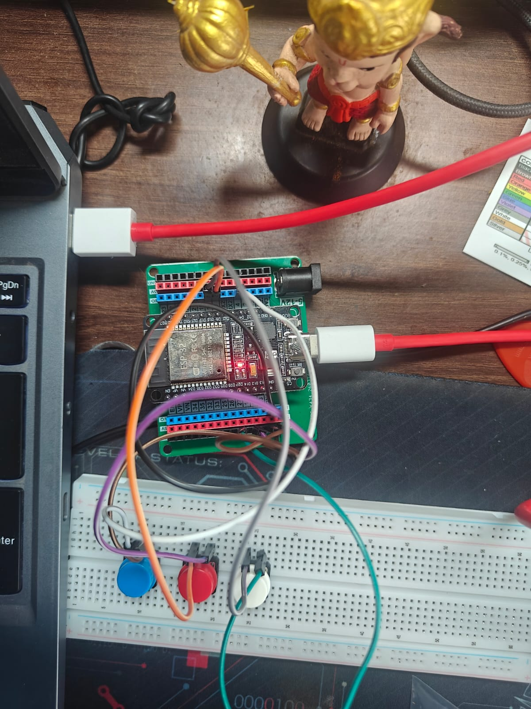

# ESP32 Digital Counter - Version 3

Version 3 expands the digital counter by introducing **multiple push button controls**. In addition to incrementing the counter, users can now decrement the count or reset it back to zero using dedicated buttons.

This version builds upon the edge detection and software debouncing implemented in Version 2 while introducing the concept of handling multiple digital inputs in a scalable manner.

---

## Features

- Increment counter using a dedicated push button
- Decrement counter using a dedicated push button
- Reset counter to zero
- One count per button press
- Software edge detection
- Basic software debouncing
- Prevents the counter from going below zero
- Displays the counter value on the Serial Monitor
- Uses ESP32's internal pull-up resistors (`INPUT_PULLUP`)

---

## Components Required

- ESP32 Development Board
- 3 × Push Buttons (4-pin tactile switches)
- Breadboard
- Jumper Wires

---

## Circuit Connections

| Component | ESP32 Pin |
|----------|-----------|
| Increment Button | GPIO 4 |
| Decrement Button | GPIO 5 |
| Reset Button | GPIO 18 |
| All Buttons | GND |

> **Note:** All buttons are configured using the ESP32's internal pull-up resistors, eliminating the need for external resistors.

---

## Working Principle

- Each push button is connected between its respective GPIO pin and **GND**.
- All GPIO pins are configured using `INPUT_PULLUP`, meaning they normally read **HIGH**.
- Pressing a button pulls the corresponding GPIO pin **LOW**.
- Edge detection is used to detect the transition from **HIGH** to **LOW**, ensuring only one action is performed for each button press.
- The increment button increases the counter.
- The decrement button decreases the counter while preventing negative values.
- The reset button sets the counter back to zero.
- The updated counter value is displayed on the Serial Monitor.

---

## Example Output

```
Counter = 1
Counter = 2
Counter = 1
Counter = 0
```

---

## Concepts Learned

- Multiple Digital Inputs
- GPIO Configuration
- Internal Pull-Up Resistors
- Edge Detection
- Software Debouncing
- State Tracking
- Event-Based Programming
- Input Validation
- Serial Communication

---

## Improvements Over Version 2

- Added dedicated Increment, Decrement and Reset buttons
- Introduced handling of multiple digital inputs
- Improved project scalability by managing multiple button states

---

## Future Improvements

- OLED Display Integration
- Long Press Detection
- Non-blocking Debouncing using `millis()`
- Enhanced User Interface
- Code Refactoring for Better Scalability

---

## Images

### Circuit Diagram



### Demo


## Author

**Danger Volt**

Learning Embedded Systems one project at a time.